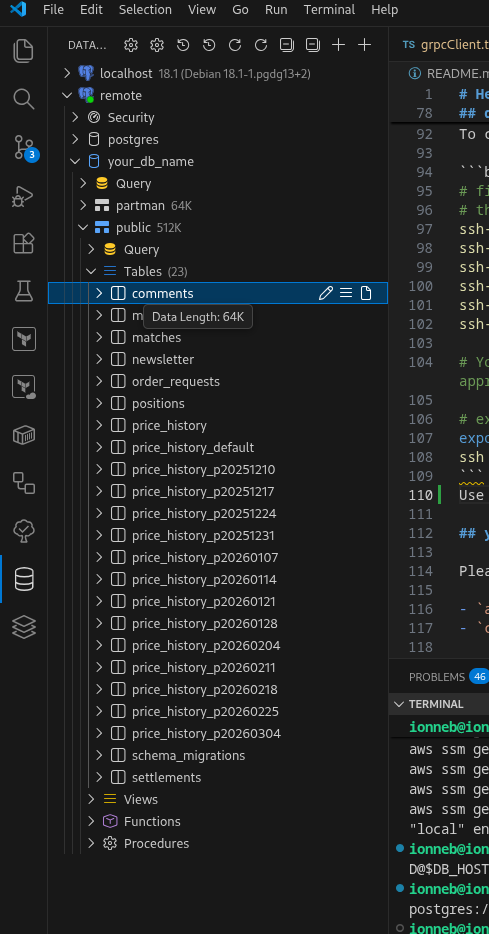
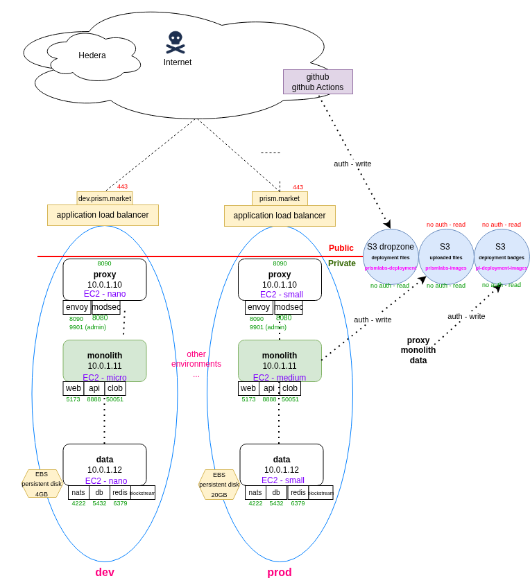
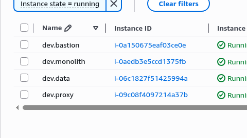

# Hedera-based prediction market

This project is divided into a number of folders:

deployable services:

- `clob`: an off-chain CLOB which matches cryptographically signed buy/sell order intents
- `api`: an API backend
- `web`: [`prism-front-end`](https://github.com/PrismMarketLabs/prism-front-end) - the main Lovable web app (Note: this is a git **submodule** to a *separate* front-end repo)
- `web.lp`: a separate landing page [`prism-landing-page-v2`](https://github.com/PrismMarketLabs/prism-landing-page-v2)
- `web.admin`: a separate web app for administrating Prism [`prism-front-end`](https://github.com/PrismMarketLabs/prism-admin) (Note: this is a git **submodule** to a *separate* front-end repo)
- `proxy`: a proxy to marshall traffic
- `modsec`: modsecurity filtering for Prism
- `eventbus`: event bus for pub/sub message communication
- `blocknode`: a node to listen to smart contract events on smart contracts of interest. Fires NATS events.
- `redis`: a general purpose memory cache for use by Prism
- ~~`mw`: middleware for web app (server-side control of preview links across social media platforms)~~

modular components:

- `scs`: on-chain smart contracts
- `infra`: infrastructure-as-code (AWS-orientated)
- `resources`: a version-controlled area to store artifacts, design files, images, etc.
- `scripts`: some general usage scripts

## real-time application observability

https://us-east-1.console.aws.amazon.com/cloudwatch/home?region=us-east-1#logsV2:log-groups

You need to have an AWS account with the correct permissions - reach out to CTO or CEO to gain access

## build status (live):

https://github.com/PrismMarketLabs/prism/actions


## currently released (live):

Below is a comprehensive and up-to-date (live) view of the version of all services that are currently deployed across the different environments.

To release a new version of a service, follow the release procedure here: https://github.com/PrismMarketLabs/prism?tab=readme-ov-file#release-procedure

`dev`

| [proxy](https://pl-deployment-badges.s3.amazonaws.com/dev/proxy.svg) | [monolith](https://pl-deployment-badges.s3.amazonaws.com/dev/monolith.svg) | [data](https://pl-deployment-badges.s3.amazonaws.com/dev/data.svg) |
|---|---|---|
|  |  |  |

<!-- `uat`

| [proxy](https://pl-deployment-badges.s3.amazonaws.com/uat/proxy.svg) | [monolith](https://pl-deployment-badges.s3.amazonaws.com/uat/monolith.svg) | [data](https://pl-deployment-badges.s3.amazonaws.com/uat/data.svg) |
|---|---|---|
|  |  |  | -->

`prod`

| [proxy](https://pl-deployment-badges.s3.amazonaws.com/prod/proxy.svg) | [monolith](https://pl-deployment-badges.s3.amazonaws.com/prod/monolith.svg) | [data](https://pl-deployment-badges.s3.amazonaws.com/prod/data.svg) |
|---|---|---|
|  |  |  |

## Prism domain names

Access the application at:

| Environment | URI                        | Password? |
|-------------|----------------------------|-----------|
| `local`     | http://prism.local:8090    | Y         |
| `dev`       | https://dev.prism.market   | Y         |
| `uat`       | https://uat.prism.market   | Y         |
| ...         | ...                        |           |
| `prod`      | https://prism.market       | N         |

## Quickstart

Add the following to your /etc/hosts file:

```bash
# see: envoy.tmpl.yaml
127.0.0.1 prism.local
127.0.0.1 admin.prism.local
127.0.0.1 previewnet.prism.local
127.0.0.1 testnet.prism.local
127.0.0.1 mainnet.prism.local
```

```bash
# ensure docker is installed on your machine and `docker compose` is available

# convenience script to start db, eventbus, proxy, blocknode:
./localRun.sh
docker ps

# convenience script to stop db, eventbus, proxy, blocknode:
./localStop.sh
docker ps


###
# Alternatively, run manually:
###
# load all env vars
source ./api/loadEnv.sh local
source ./clob/loadEnv.sh local
source ./db/loadEnv.sh local
source ./eventbus/loadEnv.sh local
source ./proxy/loadEnv.sh local # local2
# source ./web/loadEnv.sh local # note: the web app is zero config

# now do:
docker compose -f docker-compose-proxy.yml up -d
docker compose -f docker-compose-data.yml up -d
docker compose -f docker-compose-monolith.yml up -d
```

## Start web apps

There are 3 web apps:

- `web`
- `web.lp` - landing page
- `web.admin` - admin page

Open a separate tab for each web app:

**web**

`cd web && npm install && npm gen`

`npm run dev`

If required, you can optionally edit `grpcClient.ts` and set the baseUrl to the dev environment. For example: `baseUrl: 'https://dev.prism.market:443'`

**web.lp**

`web.lp && npm gen && npm install`

`npm run dev`

**web.admin**

`npm.admin && npm gen && npm install`

`npm run dev`

Can now access the three web applications at:

| app       | URL                              |
|-----------|----------------------------------|
| web.lp    | http://prism.local:8090/         |
| web       | http://testnet.prism.local:8090/ |
| web.admin | http://admin.prism.local:8090/   |

## Manual start (local development)

To develop the application locally, start up each of the following services (in the order below) in a separate terminal window:

- `db`: see [db/README.md](db/README.md)
- `eventbus`: see [eventbus/README.md](eventbus/README.md)
- `api`: see [api/README.md](api/README.md)
- `clob`: see [clob/README.md](clob/README.md)
- `web`: see [web/README.md](web/README.md)
- `proxy`: see [proxy/README.md](proxy/README.md)

## login to EC2 boxes with SSM

Run the utility script:

`./ec2_instanceIds.sh`

And follow the instructions

Once you connect, do:

`sudo su - admin`

## connect to a database (local, dev, uat, prod, etc.)

Connect to the database as follows:

database

`aws ssm start-session --target $EC2ID --document-name AWS-StartPortForwardingSession --parameters "portNumber"=["5432"],"localPortNumber"=["9999"] --profile prism --region us-east-1`

Use the VSCode plugin called "Database Client"



Login details:

Now that the tunnel is running, you can now connect to the remote Postgresql database on localhost port 9999 as shown:


## yaak/Postman

Please use [yaak](https://yaak.app/) (gRPC protocol) for graphical requests to the following services:

- `api`
- `clob`

There is a yaak collection checked in `yaak.json`

## Sync

Note on syncing:

The following files and documentation notes MUST be kept in sync. If you add/remove/change a config or secret, please ensure it's documented and is reflected everywhere else.

`docker-compose-data.yml`
 - db/Dockerfile (including the run command documentation)
 - db/.config*
 - db/.secrets
 - eventbus/Dockerfile (including the run command documentation)
 - eventbus/.config*
 - eventbus/.secrets
 - blocknode/.config*

`docker-compose-monolith.yml`
 - api/Dockerfile (including the run command documentation)
 - api/.config*
 - api/.secrets
 - main.go
 - clob/Dockerfile (including the run command documentation)
 - clob/.config*
 - clob/.secrets
 - main.rs

`docker-compose-proxy.yml`
 - proxy/Dockerfile (including the run command documentation)
 - proxy/.config*
 - proxy/.secrets (if applicable)

## Infra components

Infra design:



AWS (dev):



For further information, see the infra [README](infra/README.md)

## Docker container registry

Please use ghcr (Github container registry) only for images.

https://github.com/orgs/PrismMarketLabs/packages

Create a PAT here: https://github.com/settings/tokens/new - check `read:packages`, `write:packages` and `delete:packages`

Call the token "PACKAGE_RW"

```bash
 export PAT=ghp_...
echo $PAT | docker login ghcr.io -u zoikhash --password-stdin # note: use your github username, "zoikhash" in this case
# you may have to install `pass` and `docker-credential-pass`
# or delete '{ "credsStore": "pass" }' from ~/.docker/config.json
```

Docker build instructions are at the top of the Dockerfiles

```bash
docker build -t ghcr.io/prismmarketlabs/envoy:0.1.0 . # Note the org name is all lowercase. Note the verison number
docker push ghcr.io/prismmarketlabs/envoy:0.1.0
```

```bash
export PAT=<personal_access_token>
echo $PAT | docker login ghcr.io --username MuzanHash --password-stdin

# example push:
docker push ghcr.io/NAMESPACE/IMAGE_NAME:v0.0.3
```

All (tagged) images should be pushed to this location.

All images **must** use [semantic versioning](https://semver.org/).

## Versioning

Each service MUST be versioned.

Semver (semantic versioning) MUST be used.

For example, version a docker image using the service NAME and the latest VERSION:

```bash
export NAME=ghcr.io/prismmarketlabs/api
export VERSION=0.1.0
```

*Note: NAME must be one of {api, clob, db, eventbus, proxy, web, web.eng}*

`docker build -t ghcr.io/prismmarketlabs/${NAME}$:${VERSION} .`

`docker push ghcr.io/prismmarketlabs/${NAME}:$(VERSION)`

*Note: the latest version doesn't just get deployed automatically - a release is assembled together using a number of known-to-be stable service versions*

*Note: version numbers should never go down, always advancing*

## Releases/deployments

All releases are specified in `docker-compose-SERVICE.ENV.yml` override files.

[Semantic versioning](https://semver.org/) **must** be used.

There is an **intentional separation** between **configuration** (`.config.ENV`) and **secrets** (`secrets`):

```bash
# Safe to check-in these files
.config
.config.local
.config.dev
.config.prod
```

```bash
# Safe to check-in these files, however, do NOT check in the secret itself. Only checkin the references to the secret on `aws ssm`
.secrets # environment is handled by `source loadEnv.sh local`
```

**N.B. do NOT check in secrets - only check-in references to secrets**

## Release procedure

### Automatic release procedure:

- `cd prism`
- ensure all changes are checked in
- ~~pull any changes in the sub-modules (e.g. `cd web.lp` `git pull`)~~
- observe a green build for the service you're interested in releasing: https://github.com/prismmarketlabs/prism/actions
- after a green build, an (untagged) image should now be available in https://github.com/orgs/PrismMarketLabs/packages
- run `./tag.sh` for each of the (untagged, `latest`) services you wish to tag
- follow the interactive prompts. *note: tag.sh automatically increments the patch version for you. You can (optionally) update the major and minor versions, as appropriate*
- wait for the deployment to `dev` (it takes about 30 seconds to 60 seconds for the AWS EC2 instance to pick up the change)
- monitor logs for an appropriate burn-in period

Roll-back procedure:

- In the event of observing an error, if possible, roll back to the previous version by reverting the version number to the previous number that was running nominally
- check in the change to the `docker-compose-*.yml` file(s) as appropriate
- wait for the deployment to complete (it takes about 30 seconds to 60 seconds for the AWS EC2 instance to pick up the change)
- monitor logs for an appropriate burn-in period
- **Note**: some application versions cannot be rolled back - developers should design their applications so that they can be rolled back (e.g. always include database down migrations)
- If the application still cannot be rolled back, you must fix-forward the error with a new patched release

To elevate to a higher environment (e.g. `prod`):

- open the `docker-compose-*.yml` file for a lower environment that you are happy with: copy the stable version
- **make sure the version you have copied is stable in a lower environment and is compatible with all other services in the Prism application**
- carefully paste this version into `docker-compose-*.prod.yml`
- check in changes to the `docker-compose-*.prod.yml` file
- wait for the deployment to `prod` (it takes about 30 seconds to 60 seconds for the AWS EC2 instance to pick up the change)
- monitor logs for an appropriate burn-in period

### reload a service (keep the same version)

Login to the box directly.

e.g. reload `modsec`:

```bash
./0_pull_latest.sh 
source 1_loadEnvVars.sh <ENV>
docker compose pull modsec && docker compose up -d --force-recreate modsec
```

### free up disk space

`docker image prune -a -f`


### Manual release procedure:

1. tag the image
2. update the docker-compose-<SERVICE>.<ENV>.yml file
3. push the source code
4. login to the box (via `aws ssm`) and refresh the running image(s)

### 1. tag the image

View all the images here: https://github.com/orgs/PrismMarketLabs/packages

For security reasons, **please do NOT push tagged images that were built locally/manually - only tag those images that were built via github Actions**

### 2. update the docker-compose-SERVICE.ENV.yml file

And update the docker-compose-SERVICE.ENV.yml with the new version.

### 3. push the source code

`git add .`

`git commit -m"..."`

`git push`

```bash
## **Please note**: there is now a script to peform this more quickly:
# ./tag.sh
# follow the prompts

# first set these three env vars:
export IMAGE_SRC=ghcr.io/prismmarketlabs/web # web.eng
export IMAGE_DST=$IMAGE_SRC # ghcr.io/prismmarketlabs/web
# note: it is comment for IMAGE_SRC and IMAGE_DST to be the same
export VER_SRC=latest # or, a specific tag
export VER_DST=0.1.1


docker pull $IMAGE_SRC:$VER_SRC
docker tag $IMAGE_SRC:$VER_SRC $IMAGE_DST:$VER_DST

docker images | grep $IMAGE_DST


# now do:
docker push $IMAGE_DST:$VER_DST
```

### 4. login to the box (via aws ssm) and refresh the running image

```bash
./0_pull_latest.sh
source ./1_loadEnvVars.sh
./2_dockerComposeUp.sh
# may need to:
docker compose restart
```

View running versions/tags/docker image shas:

`docker compose ps -q | xargs docker inspect --format '{{.Name}} {{.Config.Image}} {{.Image}}'`

### AWS secrets

Use `aws ssm` to store and retrieve secrets for a particular environment.

View all secrets

```bash
cat `find . -name ".secrets*"` | sort | uniq

aws ssm describe-parameters --parameter-filters Key=Type,Values=SecureString | grep "Name" | grep local
```

Store a secret:

```bash
export ENV=local
 aws ssm put-parameter --name "/$ENV/DB_PWORD" --value "XXXX" --type SecureString --overwrite --profile prism --region us-east-1
```

Retrieve all secrets:

```bash
export ENV=local
aws ssm get-parameters-by-path --path "/$ENV" --profile prism --region us-east-1 | grep "Name"
```

Or...

```bash
# view all secrets:
aws ssm describe-parameters --query "Parameters[?Type=='SecureString'].Name" --output json  --profile prism --region us-east-1 | jq -r '.[]' | sort | jq -R . | jq -s .

# or:
aws ssm describe-parameters --query "Parameters[?Type=='SecureString'].Name" --output text
```


Retrieve a secret:

```bash
export ENV=local
aws ssm get-parameter --name "/$ENV/DB_PWORD" --with-decryption
```

Delete a secret:

```bash
export ENV=local
aws ssm delete-parameter --name "/$ENV/DB_PWORD"
```

### local

```bash
# run manually
# load all config/secrets:
source ./api/loadEnv.sh local
source ./clob/loadEnv.sh local
source ./db/loadEnv.sh local
source ./eventbus/loadEnv.sh local
source ./blocknode/loadEnv.sh local
source ./proxy/loadEnv.sh local

docker compose -f docker-compose-proxy.yml up -d
docker compose -f docker-compose-monolith.yml up -d
docker compose -f docker-compose-data.yml up -d
```

### dev

Login to each of the dev boxes. Run:

```bash
# On Proxy:
source ./proxy/loadEnv.sh dev
docker compose -f docker-compose-proxy.yml -f docker-compose-proxy.dev.yml up -d
# On Monolith:
source ./api/loadEnv.sh dev
source ./clob/loadEnv.sh dev
docker compose -f docker-compose-monolith.yml -f docker-compose-monolith.dev.yml up -d
# On Data:
source ./db/loadEnv.sh dev
source ./eventbus/loadEnv.sh dev
docker compose -f docker-compose-data.yml -f docker-compose-data.dev.yml up -d
```

### prod

Login to each of the prod boxes. Run:

```bash
# On Proxy:
docker compose -f docker-compose-proxy.yml -f docker-compose-proxy.prod.yml up -d
# On Monolith:
source ./api/loadEnv.sh prod
source ./clob/loadEnv.sh prod
docker compose -f docker-compose-monolith.yml -f docker-compose-monolith.prod.yml up -d
# On Data
source ./db/loadEnv.sh prod
source ./eventbus/loadEnv.sh prod
docker compose -f docker-compose-data.yml -f docker-compose-data.prod.yml up -d
```

### docker

View container CPU/memory usage:

`docker stats`

View the env vars available in an image:

`docker run --env-file .config.local --rm ghcr.io/prismmarketlabs/db:$VERSION env`

In your Dockerfiles, try to avoid:

- ARG
- ENV
- "latest" images - use a specific version

### Screencast transcode

Reduce to 480p:

`ffmpeg -i 'Screencast from 2025-11-17 14-14-57.webm' -vf scale=1280:-1 -c:v libvpx-vp9 -crf 32 -b:v 0 -c:a libopus output.webm`

### diff

`gvimdiff`

### kubernetes

*Note: in the future, we may move to k8s*

The deployment prodecure would change in this case.

## hts

[Hedera Token Service](https://hedera.com/token-service) (hts) offers many potential advantages:

Potential advantages:

- near-zero tx fees (there may be interesting economic effects flowing from this)
- security: fewer lines of smart contract code (native tokens are at the protocol level, smart contract interfaces built rigorously by Hedera)
- ability to "pre-approve" funds up to a certain amount (as opposed to user having to "deposit" funds)
- no token association UX flow needed
- small dollar txs may encourage bots! (there may be a SPAM issue with this though...)
- etc.

Potential disadvantages:

- UI experience for the user due to [hts] token association requirements
- cluttering of user wallet with tokens (possible to use a single Fungible/NFT token?)
- ERC20-style smart contracts may cost more
- ERC20-style smart contracts may be incompatible with ed25519 key
- etc.

## Digital signatures

Every transaction initiated by the user has a digital signature.

`sig` is calculated based on the payload below (alphabetical ordering). The payload to construct a sig is a subset of the fields in `PredictionIntentRequest` in `api.proto`.

```golang
type ObjForSigning struct {
  BuySell                uint8 // buy is 0xf0, sell is 0xf1. Note: '0' and '1' doesn't work for technical reasons - odd number of bits in the register doesn't play well with keccak hashing algos. In Solidity (and many other languages), a bool gets encoded as 0x00 or 0x01 (a single byte)
  CollateralUsdAbsScaled uint256 // uint256 may seem a lot, but kept this way to reduce on-chain casting to uint256 (e.g. ERC20)
  EvmAdd                 address/uint160 // a 20-byte EVM address is 160-bits. Note: the evmAddress is fixed. It is derived *once* at account creation.
  MarketIdUUID           uint128
  TxIdUUID               uint128
  PrimarySecondary       uint8 // primary ('p') is 0xf0, secondary ('s') is 0xf1. Note the technical reasons for BuySell above.
}
```

The marketId, the amount under consideration and the initiator account (immutable evmAddress) are assembled together for signing. This assembly design prevents others from sending signed txs to the API that could be used elsewhere, replayed, etc.

See: `assemblePayloadHexForSigning(...)` in ./web.eng/lib/utils.ts

See: `AssemblePayloadHexForSigning(...)` in ./api/server/lib/sign.go

See: `assemblePayload(...)` in ./scs/contracts/Prism.sol

```go
// signature format for comments:
commentPayload := fmt.Sprintf("%s:%s:%s", req.MarketId, req.AccountId, req.Content)
```

## Add a submodule to your monorepo (web)

`web` is a submodule

`prism-front-end` is being developed separately in its own separate repo.

```bash
cd prism
# add the submodule and make it available in the "web" folder
git submodule add git@github.com:PrismMarketLabs/prism-front-end.git web
```

1. add the following notification github workflow to prism-front-end (.github/workflows/notify-parent.yml):

```yml
# .github/workflows/notify-parent.yml
name: Notify Parent Repo

on:
  push:
    branches: [main] # or your default branch

jobs:
  notify:
    runs-on: ubuntu-latest
    steps:
      - name: Call parent repo workflow
        run: |
          curl -X POST \
            -H "Accept: application/vnd.github+json" \
            -H "Authorization: Bearer ${{ secrets.PARENT_REPO_TOKEN }}" \
            https://api.github.com/repos/PrismMarketLabs/prism/dispatches \
            -d '{"event_type":"web-submodule-updated"}'
```

2. create a token (classic) (https://github.com/settings/tokens) with scopes: [repo]. Call it "repo_notifications"

ghp_******

3. Add this repo_notifications token ("PARENT_REPO_TOKEN") to the prism-front-end submodule's repo (repository secrets): 
- https://github.com/PrismMarketLabs/prism-front-end/settings/secrets/actions
- https://github.com/PrismMarketLabs/prism-admin/settings/secrets/actions

4. Add the following to the standard build-web.yml (rename it build-web__submodule__.yml to be explicit about it being a submodule):

```yml
on:
  repository_dispatch:
    types: [web-submodule-updated]
  push:
    paths:
      - 'web/**'


...


  steps:
  - name: Checkout code
    uses: actions/checkout@v3
    with:
      submodules: true  # Fetch submodules
      token: ${{ secrets.READ_REPO }}  # N.B. need a repository secret (repo scope)

   # also need an *additional* step to pull the latest changes from all submodules, ensuring we have the latest code before building the Docker image:
  - name: Update submodules to latest commit
    run: |
      git submodule update --remote --recursive
...

```

5. Create another token called "READ_REPO":

- https://github.com/settings/tokens

- add it to the prism-front-end so the prism github Action can pull in the submodule code

- https://github.com/PrismMarketLabs/prism/settings/secrets/actions

- "Repository secrets": "READ_REPO" xxxxxxxx

6. Note: may need to do the following to update the "web" submodule:

`git submodule update --remote -- web`

discard those submodule pointer drifts by checking each submodule back to the superproject’s recorded commit, then re-run status to confirm a clean tree:

`git submodule update --checkout -- web web.admin web.lp && git status --short && git submodule status`

Maybe this will work if things get out of sync (origin/main still points to the old missing submodule SHAs; the fix is staged locally but not committed/pushed. Commit those three gitlink updates and pushing to main so Actions can fetch valid refs):

```bash
git diff --cached --submodule=log -- web web.admin web.lp && git commit -m "Fix submodule refs for CI checkout" && git push origin main

git status --short && git rev-parse --short HEAD && git ls-tree HEAD web web.admin web.lp
```

## Smart contract matching logic

It is critical to the correct execution of the Prism smart contract that a user's `PrismPredictionIntentRequest` is presented to the smart contract in the required format.

<!-- ## PrismPredictionIntentRequest order types

| price_usd | primary_secondary |  | order type | note                                                              |
|-----------|-------------------|--|------------|-------------------------------------------------------------------|
| +         | p                 |\|| BUY        | BUY/YES                                                           |
| +         | s                 |\|| SELL       | SELL/NO                                                           |
| -         | p                 |\|| BUY        | a negative price_usd with primary_secondary = 's' is a BUY/NO     |
| -         | s                 |\|| SELL       | a negative price_usd with a primary_secondary = 's' is a SELL/YES | -->

## Order of events emitted by the CLOB

When a match occurs, the two equal and opposing orders are sent to a Hedera smart contract for settlement.

The form of this match is a tuple `[order1, order2]`.

For primary orders (primary_secondary='p') the order with a positive price is **always** at position 0 in the tuple.

For secondary orders (primary_secondary='s'), the ordering is slightly different.

Must ensure that the following smart contract logic is valid in Solidity:

| primarySecondarySlot0 | primarySecondarySlot1  | Collateral flow                                                 |
|----------------------|------------------------|-----------------------------------------------------------------|
| false                | false                  | both deposit collateral into the contract                       |
| true                 | false                  | buyer deposits collateral into the contract, pays seller        |
| false                | true                   | buyer deposits collateral into the contract, pays seller            |
| true                 | true                   | contract pays both sellers                                      |

*Note: `primarySecondarySlot{0,1}` is of type `boolean`. primary is **false**. secondary is **true**.*

*Note: primarySeconarySlot0 is always the first element in the tuple. primarySecondarySlot1 is always the second element in the tuple*

For the smart contract call, the ordering is token-side based, never price-sign based.

Use this invariant for the Solidity function `posColToksOnBehalfAtomic(...)`:

1. Argument set YES: signerSlot0, txIdSlot0, sigObjSlot0, primarySeconarySlot0 **must** correspond to the YES leg.
2. Argument set NO: signerSlot1, txIdSlot1, sigObjSlot1, primarySecondarySlot1 **must** correspond to the NO leg.

And for secondary orders:

1. SELL/YES (secondary) must be passed in the YES slot with primarySeconarySlot0=true.
2. SELL/NO (secondary) must be passed in the NO slot with primarySecondarySlot1=true.

In short: YES first, NO second at the contract boundary, **always**.

Why: the contract enforces YES/NO semantics by parameter position and booleans (not by an external price_usd convention)

```solidity
function posColToksOnBehalfAtomic(
    uint128 marketId,
    address signerSlot0,
    address signerSlot1,
    uint256 collateralUsdAbsScaledSlot0,
    uint256 collateralUsdAbsScaledSlot1,
    uint256 qtyScaledSlot0,
    uint256 qtyScaledSlot1,
    uint128 txIdSlot0,
    uint128 txIdSlot1,
    bytes calldata sigObjSlot0,
    bytes calldata sigObjSlot1,
    bool primarySecondarySlot0,
    bool primarySecondarySlot1
  ) { ...
```

If you map by price sign (`price_usd`) instead of token side, you can trigger the wrong branch (for example, "Insufficient NO tokens" contract errors when actually selling YES).

Below is the authoritative format for `PrismPredictionIntentRequest` which the API expects:

| | price_usd | primary_secondary |\|| YES/NO | buy/sell |
|-|-----------|-------------------|--|--------|----------|
|1| +         | p                 |\|| Y      | buy      |
|2| +         | s                 |\|| N      | sell     |
|3| -         | p                 |\|| N      | buy      |
|4| -         | s                 |\|| Y      | sell     |

Ensure:

- Front end user interface comforms to the logic in the table above
- on-chain settlement slot handling in `Prism.sol`
- the tuple routing in `nats.go` accurately reflects end-to-end, the README.md definition

Example 1 (API log having received a `PrismPredictionIntentRequest` from the frontend):

```bash
2026-06-07 11:13:26	INFO	prediction intent request	{"request": "tx_id:\"019ea192-a2b0-7103-b904-a54b6383ee2e\"  net:\"testnet\"  market_id:\"019e893d-9d92-775d-afa6-1016a1ee3af6\"  generated_at:\"2026-06-07T10:13:22.225Z\"  account_id:\"0.0.7090546\"  price_usd:0.49  qty:0.6122448979591837  sig:\"AeYyNBZZJTS5szxehEQQymqLy0ZdcGT3pDb/RrZNJUVb/xLnxW59JPP6EFPTmp9fsjq1o879lxRod/wJExHrbg==\"  public_key:\"03b6e6702057a1b8be59b567314abecf4c2c3a7492ceb289ca0422b18edbac0787\"  evm_address:\"440a1d7af93b92920bce50b4c0d2a8e6dcfebfd6\"  key_type:2  primary_secondary:\"p\""}
2026-06-07 11:13:26	INFO	payloadUtf8: f000000000000000000000000000000000000000000000000000000000000493e0440a1d7af93b92920bce50b4c0d2a8e6dcfebfd6019e893d9d92775dafa61016a1ee3af6019ea192a2b07103b904a54b6383ee2ef0
2026-06-07 11:13:26	INFO	**Signature is valid for account 0.0.7090546**
2026-06-07 11:13:26	INFO	https://testnet.mirrornode.hedera.com/api/v1/accounts/0.0.7090546/allowances/tokens?spender.id=eq:0.0.9070333&token.id=eq:0.0.429274
2026-06-07 11:13:26	INFO	Allowance amount: 15493596
2026-06-07 11:13:26	INFO	Spender allowance for account 0.0.7090546 on contract 0.0.9070333: $15.49
2026-06-07 11:13:27	INFO	Current USDC balance for account 0.0.7090546: $82.27
2026-06-07 11:13:27	INFO	Spender allowance for account 0.0.7090546: $15.49
2026-06-07 11:13:27	INFO	[primary] User has enough allowance and balance to cover this order of $USD0.30
2026-06-07 11:13:27	INFO	Published order to NATS subject 'clob.orders': {"tx_id":"019ea192-a2b0-7103-b904-a54b6383ee2e","net":"testnet","market_id":"019e893d-9d92-775d-afa6-1016a1ee3af6","account_id":"0.0.7090546","price_usd":0.49,"qty":0.6122448979591837,"qty_orig":0.6122448979591837,"sig":"AeYyNBZZJTS5szxehEQQymqLy0ZdcGT3pDb/RrZNJUVb/xLnxW59JPP6EFPTmp9fsjq1o879lxRod/wJExHrbg==","public_key":"03b6e6702057a1b8be59b567314abecf4c2c3a7492ceb289ca0422b18edbac0787","evm_address":"440a1d7af93b92920bce50b4c0d2a8e6dcfebfd6","key_type":2,"primary_secondary":"p"}
2026-06-07 11:13:27	INFO	prediction intent saved	{"accountId": "0.0.7090546", "txId": "019ea192-a2b0-7103-b904-a54b6383ee2e"}
```

Example 2 (API log having received a `PrismPredictionIntentRequest` from the frontend):

```bash
2026-06-07 11:12:02	INFO	prediction intent request	{"request": "tx_id:\"019ea191-3ef1-742e-a36b-335cf29cf5e1\"  net:\"testnet\"  market_id:\"019e893d-9d92-775d-afa6-1016a1ee3af6\"  generated_at:\"2026-06-07T10:11:51.155Z\"  account_id:\"0.0.7090546\"  price_usd:0.49  qty:0.02  sig:\"9vnvPXvvJkFSWJEqWxJFArcUHTnxXONQlG/eO6PDlOUFlwfpDTglLPktZ5Yd1ZJVDvoD57As4xsN7nh53LZRLA==\"  public_key:\"03b6e6702057a1b8be59b567314abecf4c2c3a7492ceb289ca0422b18edbac0787\"  evm_address:\"440a1d7af93b92920bce50b4c0d2a8e6dcfebfd6\"  key_type:2  primary_secondary:\"s\""}
2026-06-07 11:12:02	INFO	payloadUtf8: f00000000000000000000000000000000000000000000000000000000000002648440a1d7af93b92920bce50b4c0d2a8e6dcfebfd6019e893d9d92775dafa61016a1ee3af6019ea1913ef1742ea36b335cf29cf5e1f1
2026-06-07 11:12:02	INFO	**Signature is valid for account 0.0.7090546**
2026-06-07 11:12:02	INFO	[secondary] sign convention: negative price_usd => SELL/YES, positive price_usd => SELL/NO. Incoming price_usd=0.49000000
2026-06-07 11:12:03	INFO	[secondary] User has 4.24135200 'yes' position tokens and 0.16191800 'no' position tokens on market 019e893d-9d92-775d-afa6-1016a1ee3af6
2026-06-07 11:12:03	INFO	[secondary] User has 0.16191800 'no' position tokens for market 019e893d-9d92-775d-afa6-1016a1ee3af6, existing reserved secondary NO=0.10000000, new order=0.02000000, required total=0.12000000
2026-06-07 11:12:03	INFO	Published order to NATS subject 'clob.orders': {"tx_id":"019ea191-3ef1-742e-a36b-335cf29cf5e1","net":"testnet","market_id":"019e893d-9d92-775d-afa6-1016a1ee3af6","account_id":"0.0.7090546","price_usd":0.49,"qty":0.02,"qty_orig":0.02,"sig":"9vnvPXvvJkFSWJEqWxJFArcUHTnxXONQlG/eO6PDlOUFlwfpDTglLPktZ5Yd1ZJVDvoD57As4xsN7nh53LZRLA==","public_key":"03b6e6702057a1b8be59b567314abecf4c2c3a7492ceb289ca0422b18edbac0787","evm_address":"440a1d7af93b92920bce50b4c0d2a8e6dcfebfd6","key_type":2,"primary_secondary":"s"}
2026-06-07 11:12:03	INFO	prediction intent saved	{"accountId": "0.0.7090546", "txId": "019ea191-3ef1-742e-a36b-335cf29cf5e1"}
```

Example 3 (API log having received a `PrismPredictionIntentRequest` from the frontend):

```bash
2026-06-07 11:15:11	INFO	prediction intent request	{"request": "tx_id:\"019ea194-2f9c-7334-9d04-2a8a56e59072\"  net:\"testnet\"  market_id:\"019e893d-9d92-775d-afa6-1016a1ee3af6\"  generated_at:\"2026-06-07T10:15:03.837Z\"  account_id:\"0.0.7090546\"  price_usd:-0.51  qty:0.6734693877551021  sig:\"bzbxCmijyRu+c+S7c/xreePP9bDYhddA9isQMkOfgkRVb6D81s/sMzoz7WUur/RNU3bSXhQ0FNVr9InxhsWJHw==\"  public_key:\"03b6e6702057a1b8be59b567314abecf4c2c3a7492ceb289ca0422b18edbac0787\"  evm_address:\"440a1d7af93b92920bce50b4c0d2a8e6dcfebfd6\"  key_type:2  primary_secondary:\"p\""}
2026-06-07 11:15:11	INFO	payloadUtf8: f10000000000000000000000000000000000000000000000000000000000053dad440a1d7af93b92920bce50b4c0d2a8e6dcfebfd6019e893d9d92775dafa61016a1ee3af6019ea1942f9c73349d042a8a56e59072f0
2026-06-07 11:15:11	INFO	**Signature is valid for account 0.0.7090546**
2026-06-07 11:15:11	INFO	https://testnet.mirrornode.hedera.com/api/v1/accounts/0.0.7090546/allowances/tokens?spender.id=eq:0.0.9070333&token.id=eq:0.0.429274
2026-06-07 11:15:11	INFO	Allowance amount: 15493596
2026-06-07 11:15:11	INFO	Spender allowance for account 0.0.7090546 on contract 0.0.9070333: $15.49
2026-06-07 11:15:11	INFO	Current USDC balance for account 0.0.7090546: $82.27
2026-06-07 11:15:11	INFO	Spender allowance for account 0.0.7090546: $15.49
2026-06-07 11:15:11	INFO	[primary] User has enough allowance and balance to cover this order of $USD0.33
2026-06-07 11:15:11	INFO	Published order to NATS subject 'clob.orders': {"tx_id":"019ea194-2f9c-7334-9d04-2a8a56e59072","net":"testnet","market_id":"019e893d-9d92-775d-afa6-1016a1ee3af6","account_id":"0.0.7090546","price_usd":-0.51,"qty":0.6734693877551021,"qty_orig":0.6734693877551021,"sig":"bzbxCmijyRu+c+S7c/xreePP9bDYhddA9isQMkOfgkRVb6D81s/sMzoz7WUur/RNU3bSXhQ0FNVr9InxhsWJHw==","public_key":"03b6e6702057a1b8be59b567314abecf4c2c3a7492ceb289ca0422b18edbac0787","evm_address":"440a1d7af93b92920bce50b4c0d2a8e6dcfebfd6","key_type":2,"primary_secondary":"p"}
2026-06-07 11:15:11	INFO	prediction intent saved	{"accountId": "0.0.7090546", "txId": "019ea194-2f9c-7334-9d04-2a8a56e59072"}
```

Example 4 (API log having received a `PrismPredictionIntentRequest` from the frontend):

```bash
2026-06-07 11:17:18	INFO	prediction intent request	{"request": "tx_id:\"019ea196-1de7-7274-891e-73c2cebab544\"  net:\"testnet\"  market_id:\"019e893d-9d92-775d-afa6-1016a1ee3af6\"  generated_at:\"2026-06-07T10:17:10.376Z\"  account_id:\"0.0.7090546\"  price_usd:-0.52  qty:0.17  sig:\"oiUvKMIQXQMbTYu3MC9mqlFOpU5QjXAX06kWULSHPKot8SWjAwZp9tJ2Q1fE0k15KCSLFEF59izEzsPnVs6PuQ==\"  public_key:\"03b6e6702057a1b8be59b567314abecf4c2c3a7492ceb289ca0422b18edbac0787\"  evm_address:\"440a1d7af93b92920bce50b4c0d2a8e6dcfebfd6\"  key_type:2  primary_secondary:\"s\""}
2026-06-07 11:17:18	INFO	payloadUtf8: f10000000000000000000000000000000000000000000000000000000000015950440a1d7af93b92920bce50b4c0d2a8e6dcfebfd6019e893d9d92775dafa61016a1ee3af6019ea1961de77274891e73c2cebab544f1
2026-06-07 11:17:18	INFO	**Signature is valid for account 0.0.7090546**
2026-06-07 11:17:18	INFO	[secondary] sign convention: negative price_usd => SELL/YES, positive price_usd => SELL/NO. Incoming price_usd=-0.52000000
2026-06-07 11:17:19	INFO	[secondary] User has 4.24135200 'yes' position tokens and 0.16191800 'no' position tokens on market 019e893d-9d92-775d-afa6-1016a1ee3af6
2026-06-07 11:17:19	INFO	[secondary] User has 4.24135200 'yes' position tokens for market 019e893d-9d92-775d-afa6-1016a1ee3af6, existing reserved secondary YES=0.00000000, new order=0.17000000, required total=0.17000000
2026-06-07 11:17:19	INFO	Published order to NATS subject 'clob.orders': {"tx_id":"019ea196-1de7-7274-891e-73c2cebab544","net":"testnet","market_id":"019e893d-9d92-775d-afa6-1016a1ee3af6","account_id":"0.0.7090546","price_usd":-0.52,"qty":0.17,"qty_orig":0.17,"sig":"oiUvKMIQXQMbTYu3MC9mqlFOpU5QjXAX06kWULSHPKot8SWjAwZp9tJ2Q1fE0k15KCSLFEF59izEzsPnVs6PuQ==","public_key":"03b6e6702057a1b8be59b567314abecf4c2c3a7492ceb289ca0422b18edbac0787","evm_address":"440a1d7af93b92920bce50b4c0d2a8e6dcfebfd6","key_type":2,"primary_secondary":"s"}
2026-06-07 11:17:19	INFO	prediction intent saved	{"accountId": "0.0.7090546", "txId": "019ea196-1de7-7274-891e-73c2cebab544"}
```
